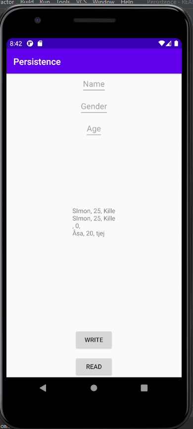

# Assignment 7: Persistence

**Skriv din rapport här!**


## activity_main.xml

I activity_main.xml lades tre EditText till. Dessa har varsitt id. "name,gender & age". Det är i dessa användaren skriver in sin text som sedan ska lagras i en rad i
databasen och senare visas på skärmen i TextView. Det har även lagts till två knappar. En med id button1 och en med id button2. Dessa knappar används för att lägga till en
rad i databasen och för att manipulera min textview så att databasens innehåll kan visas i textview. I koden nedan är ett urklipp ur activity_main.xml.Där vi kan se hur
en editext ser ut samt en button.


```
 <EditText
        android:id="@+id/name"
        android:layout_width="wrap_content"
        android:layout_height="wrap_content"
        android:hint="Name"
        app:layout_constraintLeft_toLeftOf="parent"
        app:layout_constraintRight_toRightOf="parent"
        app:layout_constraintTop_toTopOf="parent" />
        
         <Button
        android:id="@+id/button1"
        android:layout_width="wrap_content"
        android:layout_height="wrap_content"
        android:text="Read"
        app:layout_constraintBottom_toBottomOf="parent"
        app:layout_constraintLeft_toLeftOf="parent"
        app:layout_constraintRight_toRightOf="parent"
         />
```
## Skapandet utav databasen

Först skapas en klass med namn DatabaseTables innehållande utformande utav databasen. Den innehåller databasensstruktur.
I koden nedan ser vi att tabellen har namnet information. Den ska ha en column med gender vilken ska innehålla
en string. Den har en column med name också denna en string. Sist finns en age som också ska lagras i en string.
Tabellens class heter personInfo. Sedan visas en string hur tabellen skapas. Detta genom först create table.
Sedan ska gender in i första kolumnen, sedan name, sist age.

```
class DatabaseTables {

    static class personInfo {

        static final String TABLE_NAME = "information";
        static final String COLUMN_NAME_GENDER = "gender";
        static final String COLUMN_NAME_NAME = "name";
        static final String COLUMN_NAME_AGE = "age";

    }

    static final String SQL_CREATE_TABLE_PERSON =
            
            "CREATE TABLE " + personInfo.TABLE_NAME + " (" +
                    personInfo.COLUMN_NAME_GENDER + " TEXT ," +
                    personInfo.COLUMN_NAME_NAME + " TEXT ," +
                    personInfo.COLUMN_NAME_AGE + " INT)";
                    
                    }
                    
```
Det deklareras sedan två variabler i MainActivity för att få databasen att fungera. Dessa variabler syns i koden nedan vilken tilldelning dessa har fått. Tilldelningen görs i onCreate.

```
private SQLiteDatabase database;
private DatabaseHelper databaseHelper;

 databaseHelper = new DatabaseHelper(this);
 database = databaseHelper.getWritableDatabase();

```

## Lägga till rader i databasen

Eftersom raderna som ska läggas till databasen ska vara det som skrivs in i EditText rutorna skapas dessa först, utöver dessa skapas även knapparna och TextView. Dessa kopplas sedan ihop med sitt id i onCreate.  
Vilket gör det möjligt att använda sig utav widgetsen.

```
    private EditText editGender;
    private EditText editName;
    private EditText editAge;
    private Button read;
    private Button write;
    private TextView showtext;
    
    
        read = findViewById(R.id.button1);
        write =  findViewById(R.id.button2);
        editGender  = findViewById(R.id.gender);
        editName = findViewById(R.id.name);
        editAge = findViewById(R.id.age);
        showtext = findViewById(R.id.inserted_text);

```
För att sedan lägga till rader i databasen innehållande EditText strängarna används koden nedan. Det vill säga values.put och vi ser sedan vilken kolumn den ska stoppa in informationnen i
och vilken informaton. I den första raden så är det COLUMN_NAME_NAME alltså namnet användaren väljer att skriva. Det används sedan String.valueOf(editName.getText()). Detta visar på att
Det är innehållet i variablen editName, vilken är kopplad till en EditText. Detta görs likadant med de andra tre kolumnerna. Den returnernar sedan en insert Vilket resulterar i att en rad i databastabellen kommer läggas till
när funktionen addInfo körs.

```
private long addInfo() {


        ContentValues values = new ContentValues();
        values.put(DatabaseTables.personInfo.COLUMN_NAME_NAME, String.valueOf(editName.getText()));
        values.put(DatabaseTables.personInfo.COLUMN_NAME_AGE,String.valueOf(editAge.getText()));
        values.put(DatabaseTables.personInfo.COLUMN_NAME_GENDER,String.valueOf(editGender.getText()));
        Log.d("==>" , String.valueOf(editName.getText())  +  String.valueOf(editAge.getText()) + String.valueOf(editGender.getText()));
        return database.insert(DatabaseTables.personInfo.TABLE_NAME, null, values);
    }

```

Raderna i tabellen ska läggas till när man klickar på en knapp. Därför skapas en onClickListener på en utav knapparna. Inuti denna körs då funktionen addInfo(). Detta resulterar
i att varje gång ett knapptryck görs körs addInfo(). editAge , editName, editGender sätts sedan till en tom sträng. Detta för att nollställa. Vi har alltså nu lyckats lägga till
rader i tabellen med hjälp utav en knapp och tre EditText.


```
 write.setOnClickListener(new View.OnClickListener() {
            @Override
            public void onClick(View v) {
                addInfo();
                editAge.setText("");
                editName.setText("");
                editGender.setText("");

            }
        });

```

## Skriva ut data i TextView

För att skriva ut detta i TextView krävs en arraylist denna arraylisten måste lagra något. Därför skapas en ny class med person vilken ser ut som koden nedan. Vilket innebär att
en class med namn Person, innehållande en string med kön, en string med namn och en int med age. Detta eftersom strukturen i databasen ser ut likadant. Det har även skapats getters för varje
variabel och en constructor.


```
public class Person {
    private String gender;
    private String name;
    private int age;

    public String getGender() {
        return gender;
    }

    public int getAge() {
        return age;
    }

    public String getName() {
        return name;
    }

    public Person(int _age, String _name, String _gender) {
        age = _age;
        name=_name;
        gender=_gender;
    }
}

```
I MainActivty används koden nedan där en private List med datantypen Person skapas i funktionen fetchPerson(). Det finns även en cursor som kommer gå igenom raderna i databasen.
Vi ser även att det är databasen personInfo cursorn kommer att gå igenom. När fetchPerson körs kommer List<person> få namnet persons och tilldelas en arraylist.
Sedan ser vi en while sats innehållande cursor.moveToNext, cursorn kommer alltså gå från rad till rad tills det inte finns några rader kvar i databasen. Det skapas sedan en variabel
av datatypen Person med namn person. För varje rad i databastabellen så kommer en ny person skapas och denna personen kommer sedan läggas till i arraylisten persons. Sammantaget av koden
är att för varje rad i databastabellen kommer en person läggas till i arraylisten persons.


```
 private List<Person> fetchPerson() {
        Cursor cursor = database.query(DatabaseTables.personInfo.TABLE_NAME,
                null,
                null,
                null,
                null,
                null,
                null);
        List<Person> persons = new ArrayList<>();
        while (cursor.moveToNext()) {
            Person person = new Person(
                    cursor.getInt(cursor.getColumnIndexOrThrow(DatabaseTables.personInfo.COLUMN_NAME_AGE)),
                    cursor.getString(cursor.getColumnIndexOrThrow(DatabaseTables.personInfo.COLUMN_NAME_NAME)),
                    cursor.getString(cursor.getColumnIndexOrThrow(DatabaseTables.personInfo.COLUMN_NAME_GENDER))
            );
            persons.add(person);
        }
        cursor.close();
        return persons;

```
Sedan skapas en OnClickListener på den andra knappen, denna för att kunna skriva ut. Där skapas en list med datatypen Person med namn tmp, denna tilldelas innehållet i fetchPerson().
showtext vilken är min textview startar med en tom sträng. Detta för att den inte ska skriva ut innehållet i databasen återupprepande utan skriva ut samma värde en gång vid knapptryck.
Det används sedan en for loop som körs igenom litan tmp. För varje person så läggs en person till i variablen p. Dessa skrivs sedan ut i showtext. append används för att allting ska skrivas ut.
Det vi skriver ut är våra getters ifrån classen Person, där getname, getage och getgender skrivs ut.
```
read.setOnClickListener(new View.OnClickListener() {
            @Override
            public void onClick(View v) {
            List<Person> tmp = fetchPerson();
            showtext.setText("");
                for (int i = 0; i < tmp.size() ; i++) {
                    Person p = tmp.get(i);
                    Log.d("read==>" , p.getName());
                    showtext.append(p.getName() + ", " + p.getAge() + ", " + p.getGender() + "\n");

                }
```
Bild på resultat:



